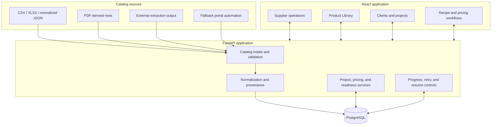

# Architecture

This document explains Leaf & Ledger's major runtime boundaries, data flow, and the design rules that keep source data traceable from intake through project use.

## System view

## Catalog intake

Every source is converted into a shared product shape. Normalized fields power search and project workflows; the original row and source metadata remain available for traceability. Duplicate detection is supplier-scoped because SKUs are not globally unique.

The importer previews parsed rows before commit. Invalid or incomplete rows are reported as review work rather than silently discarded.

## Project model

Clients contain projects. Projects contain named buckets for design areas or packages. Products can be saved as candidates without affecting calculations; only selected products contribute to recipe quantities, purchasing, and cost.

## Pricing model

Supplier price is source cost. Customer price belongs to the quote layer. Gross profit, margin, and markup are derived values and must not overwrite supplier data. When an input is missing, the UI should identify the missing input instead of presenting an invented result.

## Long-running work

Catalog discovery, enrichment, image storage, and large imports can outlive an HTTP request. These workflows expose status, checkpoints, conflict handling, and retry or resume controls. New work should favor idempotent batches over one uninterrupted run.

## Generated and platform code

The project retains generated API clients and parts of its original platform runtime. Domain behavior should be extracted gradually without rewriting stable generated foundations simply for stylistic consistency.

## Security boundary

Credentials and production data remain outside Git. Extraction output is treated as potentially sensitive because it can include account-specific prices and source URLs. Public examples use placeholders or synthetic data.
