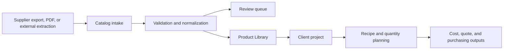

# Leaf & Ledger

Leaf & Ledger is an internal catalog and project-operations system for design teams that need to turn inconsistent supplier data into searchable products, project selections, purchasing quantities, and pricing decisions.

The application replaces a fragmented workflow of supplier portals, spreadsheets, image folders, and manual pricing calculations with one traceable system of record. It is built for the unglamorous middle of real operations: incomplete source data, duplicate products, inconsistent units, long-running imports, and work that must remain understandable to the next person.

## What it does

- Imports supplier catalogs from CSV, XLSX, PDF-derived data, or external extraction output.
- Normalizes products while retaining their source fields and provenance.
- Flags missing or questionable data for review instead of silently treating it as complete.
- Provides paginated search, filtering, favorites, and supplier readiness views.
- Organizes clients, projects, design buckets, and candidate or selected products.
- Calculates recipe-driven quantities while keeping supplier cost separate from customer pricing.
- Supports resumable enrichment and image-storage work for large catalogs.
- Generates visual mockups when an image-generation provider is configured.

## Product boundary

Leaf & Ledger owns catalog intake, validation, normalization, deduplication, search, project use, and pricing workflows. It does **not** aim to be a universal website scraper.

Supplier exports and structured files are preferred. Browser automation remains an isolated fallback for sources that cannot provide usable data. This boundary emerged from operating large portal-based imports and is documented in [Catalog Data Strategy](CATALOG_DATA_STRATEGY.md).

## Core workflow



## Architecture

| Layer | Technology | Responsibility |
| --- | --- | --- |
| Web application | React, TypeScript, Vite | Catalog, supplier, project, pricing, and mockup workflows |
| API | FastAPI, Pydantic | Validation, orchestration, business rules, and long-running job controls |
| Data | PostgreSQL | Products, suppliers, clients, projects, imports, and pricing state |
| Extraction workspace | Python, SeleniumBase | Optional file-producing supplier extraction outside the core application |
| Verification | Pytest, TypeScript, ESLint, GitHub Actions | Regression checks and reproducible builds |

See [Architecture](ARCHITECTURE.md) for boundaries and data flow.

## Repository map

```text
backend/                    FastAPI application, domain services, and tests
frontend/                   React and TypeScript web application
catalog-extraction/         Optional file-producing extraction workspace
supplier onboarding notes/ Source-intake runbooks and historical lessons
.github/workflows/          Continuous integration and manual extraction jobs
```

## Run locally

Prerequisites: Python 3.11, Node.js 18+, `uv`, and npm.

```bash
# Backend
cd backend
uv sync --all-groups
./run.sh

# Frontend, in another terminal
cd frontend
npm install
npm run dev
```

Local environment files are required for database and optional provider integrations. They are ignored by Git and must never be committed. See [Getting Started](GETTING_STARTED.md) for setup and verification details.

## Verification

```bash
cd backend && uv run pytest -q tests
cd frontend && npm run lint && npm run typecheck && npm run build
```

The backend suite currently covers catalog normalization, supplier onboarding adapters, and representative supplier parsers. CI runs the same core checks for pull requests and branch updates.

## Current status

Leaf & Ledger is an active working system, not a finished commercial product. Catalog intake, Product Library, supplier operations, clients/projects, recipe logic, pricing foundations, and mockup plumbing are implemented at different levels of maturity.

Known constraints include:

- some oversized UI and API modules are being decomposed incrementally;
- authentication and database-backed flows require local configuration;
- browser-based supplier extraction remains inherently source-dependent;
- mockup generation requires a separately configured provider key;
- deployment and scheduled-job configuration remain environment-specific.

The [Roadmap](SUPPLIER_BUILDER_ROADMAP.md) distinguishes current behavior from future work. [Project Evolution](PROJECT_EVOLUTION.md) records what was tried, what failed, and why the product boundary changed.

## Development history

The codebase began as a platform-generated full-stack starter and was subsequently scoped, extended, tested, and operated around a real catalog workflow. Generated foundations are retained where useful; product decisions, domain behavior, supplier intake, recovery mechanisms, tests, and documentation were developed iteratively as the operational problem became clearer.

## Documentation

- [Project Context](PROJECT_CONTEXT.md) — product model and invariants
- [Project Evolution](PROJECT_EVOLUTION.md) — chronological decisions and lessons
- [Architecture](ARCHITECTURE.md) — system structure and data flow
- [Operations](OPERATIONS.md) — ownership, recovery, and safe operation
- [Catalog Data Strategy](CATALOG_DATA_STRATEGY.md) — source-first intake boundary
- [Getting Started](GETTING_STARTED.md) — local setup and verification
- [Supplier Onboarding Index](supplier%20onboarding%20notes/SUPPLIER_ONBOARDING_INDEX.md) — detailed intake records

## Data and security

This repository does not include production credentials, customer records, supplier account data, or runtime catalog storage. Examples use placeholders. Before sharing logs or extraction artifacts, remove URLs, identifiers, prices, and other account-specific material.
