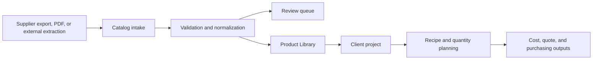

# Leaf & Ledger

Leaf & Ledger is an internal catalog and project-operations system for design teams that need to turn inconsistent supplier data into searchable products, project selections, purchasing quantities, and pricing decisions.

The application replaces a fragmented workflow of supplier portals, spreadsheets, image folders, and manual pricing calculations with one traceable system of record. It is built for the unglamorous middle of real operations: incomplete source data, duplicate products, inconsistent units, long-running imports, and work that must remain understandable to the next person.

## What it does

- Imports supplier catalogs from CSV, XLSX, PDF-derived data, or external extraction output.
- Normalizes products while retaining their source fields and provenance.
- Flags missing or questionable data for review instead of silently treating it as complete.
- Provides paginated search, filtering, favorites, and supplier readiness views.
- Organizes clients, projects, design buckets, and candidate or selected products.
- Calculates recipe-driven quantities while keeping supplier cost separate from customer pricing.
- Supports resumable enrichment and image-storage work for large catalogs.
- Generates visual mockups when an image-generation provider is configured.
- Runs a seasonal install-scheduling pipeline and a live reschedule-assist tool (see [Install Schedule](#install-schedule)) for a client's crew routing and day-of accommodation work.

## Product boundary

Leaf & Ledger owns catalog intake, validation, normalization, deduplication, search, project use, and pricing workflows. It does **not** aim to be a universal website scraper.

Supplier exports and structured files are preferred. Browser automation remains an isolated fallback for sources that cannot provide usable data. This boundary emerged from operating large portal-based imports and is documented in [Catalog Data Strategy](CATALOG_DATA_STRATEGY.md).

## Core workflow



## Architecture

| Layer | Technology | Responsibility |
| --- | --- | --- |
| Web application | React, TypeScript, Vite | Catalog, supplier, project, pricing, and mockup workflows |
| API | FastAPI, Pydantic | Validation, orchestration, business rules, and long-running job controls |
| Data | PostgreSQL | Products, suppliers, clients, projects, imports, and pricing state |
| Extraction workspace | Python, SeleniumBase | Optional file-producing supplier extraction outside the core application |
| Verification | Pytest, TypeScript, ESLint, GitHub Actions | Regression checks and reproducible builds |

See [Architecture](ARCHITECTURE.md) for boundaries and data flow.

## Install Schedule

A seasonal side-product: a Python pipeline that builds TBDG's Christmas install schedule from a raw client spreadsheet (geocoding, drive-time matrices, crew routing, business rules), and a browser-based tool for the weeks of client reschedule requests that follow after the base schedule ships.

- **Pipeline** (`scheduler/`) — `prep.py` (parse → zones → hours → geocode → OSRM drive-time matrix, all cached) → `schedule.py` (rule-driven crew-day packing, routes every day for minimum real drive time) → `route_geometry.py` (real road-following paths for the map) → `validate.py` (assertions against the generated schedule, run after every change) → `build_review.py` (emits the standalone review tool). The full rule set — Houston day shape, Dallas Mi Cocina nights, Saturday eligibility, client-pinned dates, box-count sourcing — is documented in [scheduler/RULES.md](scheduler/RULES.md).
- **Review tool** (served at `/install-schedule`, authenticated — it carries client names, addresses, and phone numbers, so it's never in `frontend/public/`) — drag-and-drop crew-day editing with guardrails: a move is checked against the same rules the pipeline used, structural breaks (a job that needs two crews, a same-day client group, club-crew coverage) stay hard blocks, and everything else (date/category rules, deposited dates) is an overridable warning so staff can accommodate an unusual request without fighting the tool. Includes a slot finder for "what dates could this move to," on-the-fly entry for jobs that were never in the spreadsheet (event takedown/reinstall pairs, callbacks) with live-fetched real drive times, and full undo/redo.
- **Shared state** — every staff member's edits land in Postgres (`ll_app.install_schedule_state`), keyed to the schedule build so an old build's saved edits are never misapplied to a regenerated one. Saves are an append-only history (`ll_app.install_schedule_history`), so a mistake can be rolled back without losing anyone else's work in between — a "History" panel in the tool lists past versions and restores any of them.
- **Notebook** (`overrides.json`) — the review tool can export every promised date (and any manually-added client) as a frozen-assignment layer; re-running the pipeline from an updated spreadsheet replays those verbatim before re-solving everything else, so a client who was already told their date doesn't get silently moved.

## Repository map

```text
backend/                    FastAPI application, domain services, and tests
frontend/                   React and TypeScript web application
scheduler/                  TBDG install-schedule pipeline and review tool (see above)
catalog-extraction/         Optional file-producing extraction workspace
supplier onboarding notes/ Source-intake runbooks and historical lessons
.github/workflows/          Continuous integration and manual extraction jobs
```

## Run locally

Prerequisites: Python 3.11, Node.js 18+, `uv`, and npm.

```bash
# Backend
cd backend
uv sync --all-groups
./run.sh

# Frontend, in another terminal
cd frontend
npm install
npm run dev
```

Local environment files are required for database and optional provider integrations. They are ignored by Git and must never be committed. See [Getting Started](GETTING_STARTED.md) for setup and verification details.

## Verification

```bash
cd backend && uv run pytest -q tests
cd frontend && npm run lint && npm run typecheck && npm run build
```

The backend suite currently covers catalog normalization, supplier onboarding adapters, and representative supplier parsers. CI runs the same core checks for pull requests and branch updates.

## Current status

Leaf & Ledger is an active working system, not a finished commercial product. Catalog intake, Product Library, supplier operations, clients/projects, recipe logic, pricing foundations, and mockup plumbing are implemented at different levels of maturity.

Known constraints include:

- some oversized UI and API modules are being decomposed incrementally;
- authentication and database-backed flows require local configuration;
- browser-based supplier extraction remains inherently source-dependent;
- mockup generation requires a separately configured provider key;
- deployment and scheduled-job configuration remain environment-specific.

The [Roadmap](SUPPLIER_BUILDER_ROADMAP.md) distinguishes current behavior from future work. [Project Evolution](PROJECT_EVOLUTION.md) records what was tried, what failed, and why the product boundary changed.

## Development history

The codebase began as a platform-generated full-stack starter and was subsequently scoped, extended, tested, and operated around a real catalog workflow. Generated foundations are retained where useful; product decisions, domain behavior, supplier intake, recovery mechanisms, tests, and documentation were developed iteratively as the operational problem became clearer.

## Documentation

- [Project Context](PROJECT_CONTEXT.md) — product model and invariants
- [Project Evolution](PROJECT_EVOLUTION.md) — chronological decisions and lessons
- [Architecture](ARCHITECTURE.md) — system structure and data flow
- [Operations](OPERATIONS.md) — ownership, recovery, and safe operation
- [Catalog Data Strategy](CATALOG_DATA_STRATEGY.md) — source-first intake boundary
- [Getting Started](GETTING_STARTED.md) — local setup and verification
- [Supplier Onboarding Index](supplier%20onboarding%20notes/SUPPLIER_ONBOARDING_INDEX.md) — detailed intake records

## Data and security

This repository does not include production credentials, customer records, supplier account data, or runtime catalog storage. Examples use placeholders. Before sharing logs or extraction artifacts, remove URLs, identifiers, prices, and other account-specific material.

Public screenshots are intentionally deferred until the application can be loaded with a synthetic demo dataset; local operational records are not suitable presentation data.
