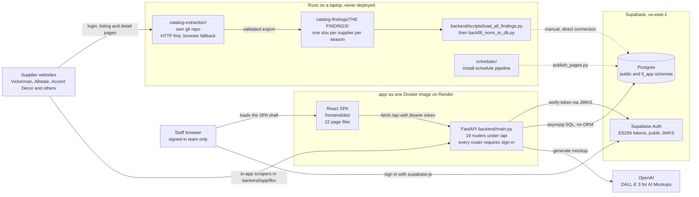
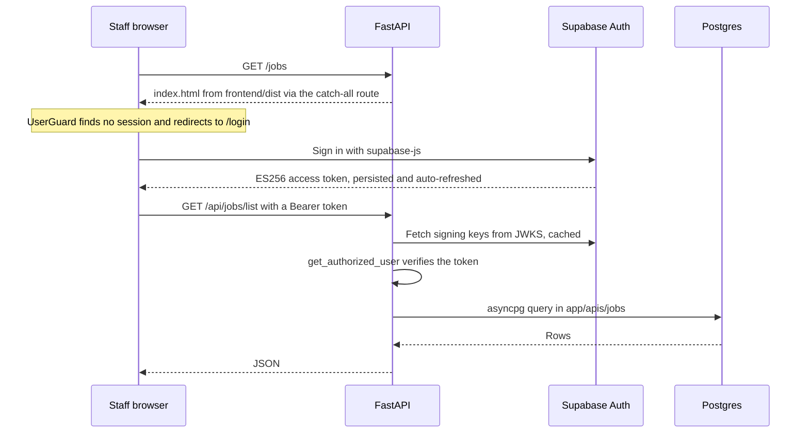
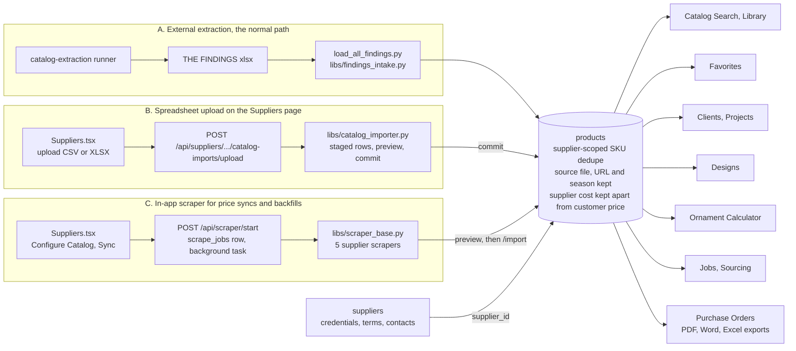
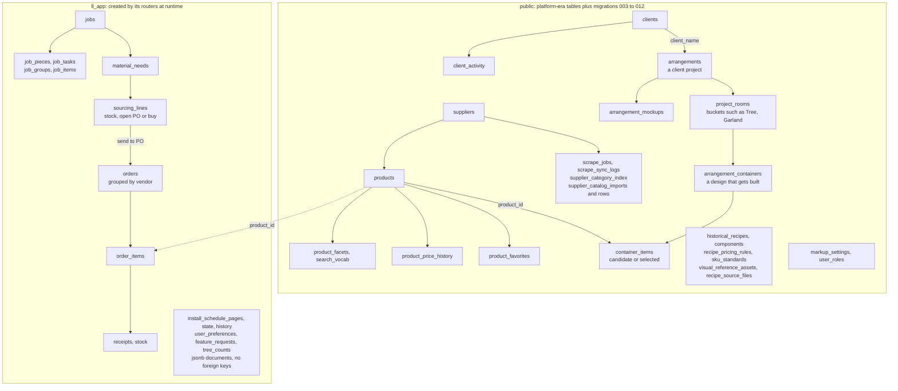

# Leaf & Ledger System Map

How the catalog-and-projects app for The Branch Design Group fits together: the folders that make one product, the single deployed service, what runs on a laptop and never ships, and how a supplier's product row travels from a website into a client's purchase order.

This page renders on GitHub. A styled version with the same content is in [SYSTEM_MAP.html](SYSTEM_MAP.html); download it and open it in a browser.

- [Status](#status)
- [1. The whole system](#1-the-whole-system)
- [2. What happens on one request](#2-what-happens-on-one-request)
- [3. How a product gets in, and where it goes](#3-how-a-product-gets-in-and-where-it-goes)
- [4. The data model](#4-the-data-model)
- [5. The install schedule loop](#5-the-install-schedule-loop)
- [Sidebar tab to page to API router to tables](#sidebar-tab-to-page-to-api-router-to-tables)
- [Where to look](#where-to-look)

## Status

Verified against `main` at `a4e4445` on 2026-09-14. Every file this map names exists on `main`; the extraction scripts exist in the separate `catalog-extraction` repo.

The refactor work in progress (`refactor/2026-09` and the follow-up `fix/test-findings` branch, not yet on `main`) was also checked.

**Still true after that work lands**

- 19 API routers, 22 page files and 5 in-app supplier scrapers.
- Every API router sits behind sign-in, and FastAPI still serves the built frontend.
- All sidebar tabs and routes are unchanged.
- The page-to-router callers in the lookup table are unchanged.
- `ll_app` tables are still created by their own routers at runtime.
- The findings load still goes through `libs/findings_intake.py`, and mockups still use DALL·E 3.

**Will need a refresh when that work lands**

| What | On `main` (this map) | After the refactor |
|---|---|---|
| `Library.tsx` lines | 3094 | 346, plus a new `pages/library/` folder |
| `Arrangements.tsx` lines | 6513 | 3916, plus a new `pages/arrangements/` folder |
| `Settings.tsx` lines | 1430 | 1306 |
| Continuous integration | backend tests, frontend lint, typecheck and build | adds a scheduler test job |
| Install schedule notebook | manual "Export notebook" button writes `overrides.json` | adds `sync_notebook.py`, which rebuilds `overrides.json` from the live board before a rerun |

None of these change how the system fits together.

## 1. The whole system

Only `app/` is deployed. It is one Docker image on Render, where FastAPI serves both the built React bundle and the `/api` routes on a single origin. The extraction repo and the scheduler run on a laptop and reach the same Supabase database directly. Dashed arrows are manual steps a person runs.

Supplier data arrives three ways (figure 3). GitHub Actions runs pytest, ESLint, tsc and the Vite build on pushes to `main` and on every pull request; it deploys nothing.

| Folder | Role | Ships? |
|---|---|---|
| `app/` | The product: `backend/` FastAPI, `frontend/` React, `scheduler/` install pipeline, Dockerfile. | Deployed |
| `app-board/` | A second checkout of this repo on the `product-requests` branch, open as pull request #8. Adds a Request Form page and a requests router. | Branch |
| `catalog-extraction/` | Supplier scrapers, per-supplier runners, normalization and export validation. Its own repo. Output is files, never database writes. | Local |
| `catalog-findings/` | `THE FINDINGS/`: the finished per-supplier spreadsheets the app loads from. | Read at load |
| `db-backups/` | Neon dumps from before the Supabase move, plus 4,668 Allstate images that can no longer be re-fetched. | Archive |
| `pricing-recipes/` | TBDG pricing worksheets, loaded by `backend/scripts/load_pricing_recipes.py` into the historical recipe tables. | Input |
| `Vickerman Ornament Rules/`, `tree-builder-assets/` | Reference material and design assets. No app code reads these folders; the ornament rules were hand-coded into `utils/ornamentRecipe.ts`. | Reference |

## 2. What happens on one request

There are no cookies and no server sessions. The browser holds a Supabase access token, every `/api` call carries it, and FastAPI checks the signature before any handler runs.

The generated `apiclient/` (Databutton-era, paths spelled `/routes/...` and rewritten to `/api/...`) and the hand-written `utils/apiFetch.ts` both attach the token. Auth can only be switched off with `AUTH_DISABLED=true` while `ENV=dev`. In local development Vite serves the pages on port 5173 and proxies `/api` to uvicorn on port 8000.

## 3. How a product gets in, and where it goes

Three intake lanes converge on one `products` table. Dedupe is scoped per supplier because SKUs collide across vendors. Missing fields stay visible as review work.

Lane A is the boundary the project chose: scraping lives outside the app and produces files. Lane C predates that decision and is kept for the five suppliers whose scrapers already work.

## 4. The data model

The core catalog and project tables sit in `public`. They came with the platform-generated starter and have no CREATE statement in this repo. Numbered SQL files in `backend/migrations/` add columns, indexes and a few tables such as `clients` and `project_rooms`. The newer operational tables live in an app-owned `ll_app` schema, and each router creates its own tables with `CREATE TABLE IF NOT EXISTS` the first time it runs. Arrows point from parent to child.

"Arrangements" in the database are what the UI calls Projects, and an "arrangement container" is what the Designs page calls a design. Only items marked selected count toward quantities and cost.

## 5. The install schedule loop

A Python pipeline turns the Christmas client spreadsheet into a routed crew schedule and a self-contained review page. That page embeds client names, addresses and phone numbers, so it is pushed straight into Postgres and served only to signed-in staff. It is never committed and never baked into the image.

```mermaid
flowchart LR
  SHEET["Client spreadsheet"] --> PREP["prep.py<br/>zones, hours, geocode"]
  PREP --> SOLVE["schedule.py<br/>rules.py crew-day packing"]
  SOLVE --> ROUTE["route_geometry.py<br/>road paths for the map"]
  ROUTE --> CHECK["validate.py<br/>asserts every rule"]
  CHECK --> BUILD["build_review.py<br/>review.html, map.html"]
  BUILD --> PUB["publish_pages.py"]
  GEO["Nominatim, OSRM"] <-->|"cached in cache/"| PREP
  PUB -.-> PAGES[("ll_app.install_schedule_pages<br/>one row per season and name")]
  PAGES --> SERVE["GET /api/install-schedule/page"]
  SERVE --> TOOL["InstallSchedule.tsx<br/>srcDoc iframe, signed-in only"]
  TOOL -->|"PUT /api/install-schedule/state"| STATE[("install_schedule_state<br/>plus append-only history")]
  TOOL -.->|"Export notebook"| NOTE["overrides.json<br/>promised dates"]
  NOTE -.->|"replayed first"| SOLVE
```

Saved state is keyed to the schedule build, so edits saved against an old build are never applied to a regenerated one. The full rules are in `scheduler/RULES.md`.

## Sidebar tab to page to API router to tables

Every sidebar entry is declared once in `components/sidebarNav.ts`, routes are listed in `user-routes.tsx`, and routers are auto-discovered from `backend/app/apis/<name>/__init__.py`. Line counts are from `main`.

| Tab | Route | Page (lines) | API routers (lines) | Main tables |
|---|---|---|---|---|
| Dashboard | `/` | App.tsx (348) | dashboard (143) | One summary call across products, suppliers, favorites, projects, designs, orders, historical recipes |
| Clients & Projects tree | `/clients`, `/projects` | Clients.tsx (1255), Arrangements.tsx (6513) | clients (468), arrangements (1259), builder (1805), recipe_intelligence (1626) | clients, client_activity, arrangements, project_rooms, arrangement_containers, container_items |
| Jobs | `/jobs`, `/sourcing` | Jobs.tsx (489), Sourcing.tsx (809) | jobs (1567), clients, products | ll_app.jobs, job_pieces, material_needs, sourcing_lines, job_tasks, stock, receipts |
| Designs | `/designs` | Designs.tsx (580) | designs (826) | arrangement_containers, container_items, products |
| AI Mockups | `/mockups` | Mockups.tsx (239) | mockups (167) | arrangement_mockups, visual_reference_assets; calls OpenAI |
| Ornament Calculator | `/ornament-calculator` | OrnamentCalculator.tsx (1700) | products (ornament-match) | products; the golden table lives in utils/ornamentRecipe.ts |
| Tree Counts | `/tree-counts` | TreeCounts.tsx (603) | tree_counts (287) | ll_app.tree_counts |
| Catalog Search | `/search` | CatalogSearch.tsx (897), Library.tsx (3094, shared modals) | products (2624) | products, product_facets, search_vocab, product_favorites |
| Suppliers | `/suppliers` | Suppliers.tsx (826) | suppliers (1359), scraper (3906) | suppliers, supplier_catalog_filters, scrape_jobs, scrape_sync_logs |
| Purchase Orders | `/orders` | Orders.tsx (299) | orders (404) plus export.py | ll_app.orders, order_items |
| Install Schedule | `/install-schedule` | InstallSchedule.tsx (105) | install_schedule (654) | ll_app.install_schedule_pages, state, history |
| Favorites | `/favorites` | Favorites.tsx (187) | products | product_favorites |
| Invoices | `/invoice` | Invoice.tsx (205) | arrangements, settings | arrangements, container_items, markup_settings |
| Comments | `/comments` | Comments.tsx (214), FeedbackWidget.tsx | feedback (208) | ll_app.feature_requests |
| Sync Operations | `/admin-dashboard` | AdminDashboard.tsx (1078) | admin_dashboard (356), scraper | scrape_sync_logs, product_price_history, supplier_category_index |
| Settings | `/settings` | Settings.tsx (1430) | settings (114), preferences (330), recipe_intelligence | markup_settings, user_roles, recipe_pricing_rules, sku_standards, ll_app.user_preferences |

The app shell, `Layout.tsx`, calls `/api/bootstrap/summary`, the client list and recent client comments on every page. `/sourcing/:jobId` (the purchaser's worksheet) and `/login` are reached by link, not from the sidebar. The weekly `POST /api/scraper/sync-prices-bulk` job listed in `SCHEDULES.md` currently has no scheduler running it.

## Where to look

| Question | File |
|---|---|
| How routers are found and locked behind auth | `app/backend/main.py` |
| JWT verification against Supabase | `app/backend/app/auth/supabase_auth.py` |
| Shared framework the in-app scrapers extend | `app/backend/app/libs/scraper_base.py` |
| Spreadsheet intake used by the manual load | `app/backend/app/libs/findings_intake.py` |
| Upload intake with preview and commit | `app/backend/app/libs/catalog_importer.py` |
| The manual load command | `app/backend/scripts/load_all_findings.py` |
| App shell, providers, error boundary | `app/frontend/src/AppWrapper.tsx` |
| Sidebar as the single source of truth | `app/frontend/src/components/sidebarNav.ts` |
| Both API helpers | `app/frontend/src/apiclient/index.ts`, `utils/apiFetch.ts` |
| Build: Vite stage, then Python stage | `app/Dockerfile` |
| Scheduling rules in prose | `app/scheduler/RULES.md` |
| Product boundary and invariants | `app/PROJECT_CONTEXT.md`, `CATALOG_DATA_STRATEGY.md` |
| Supplier runner entry point | `catalog-extraction/scripts/run_supplier.py` |
| Export contract every scraper must meet | `catalog-extraction/README.md` |
